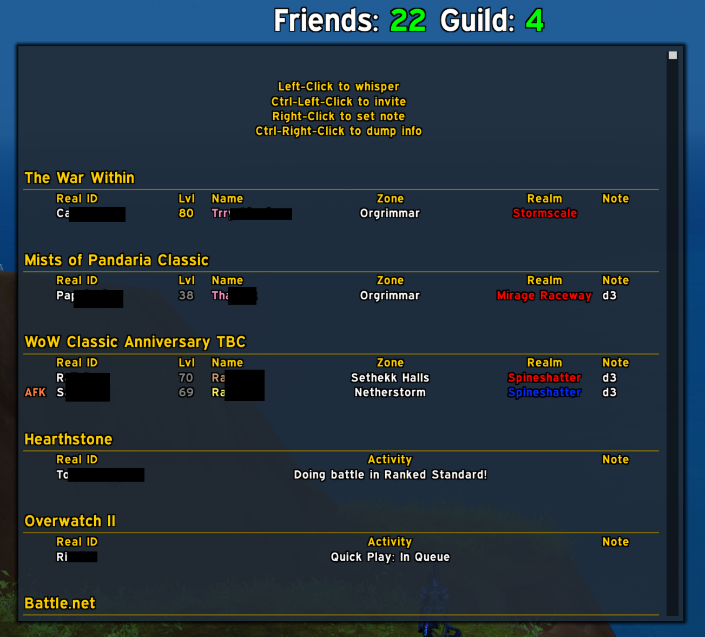
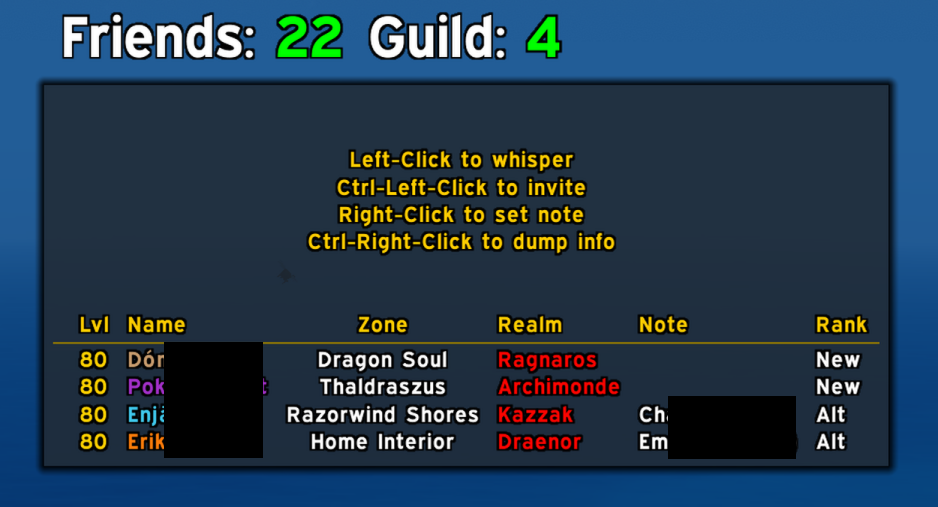
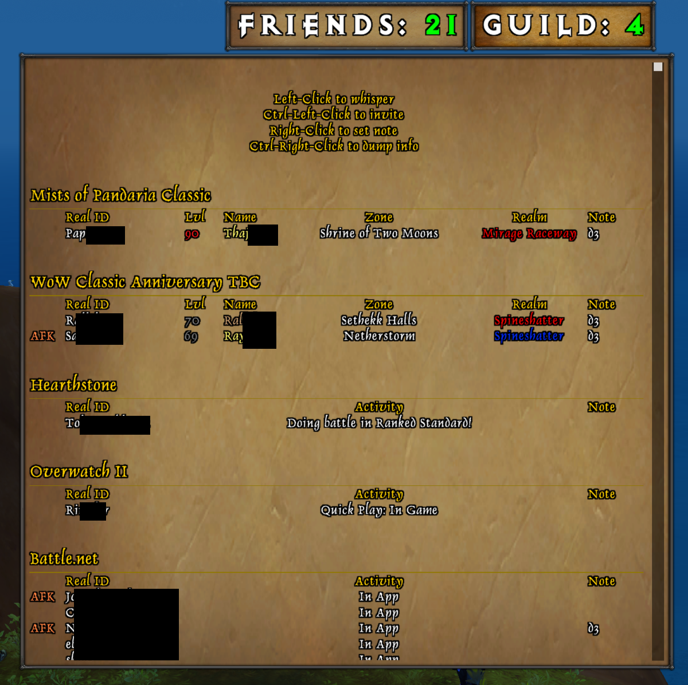
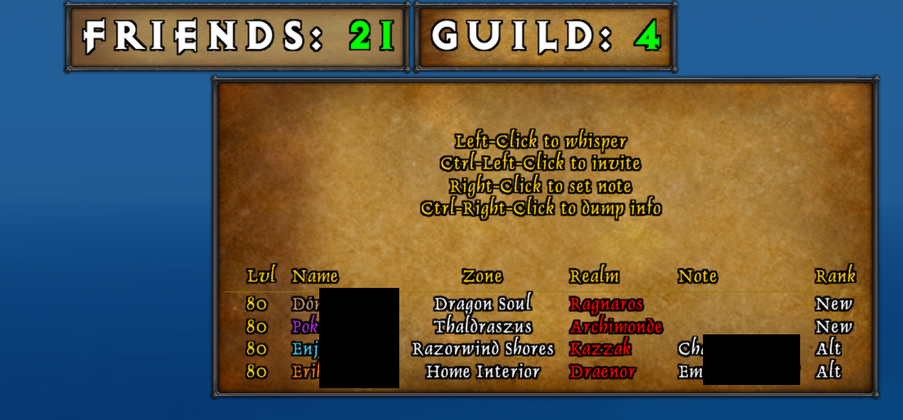
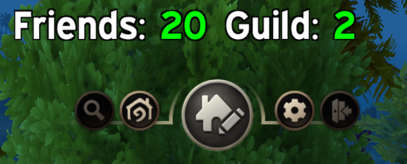
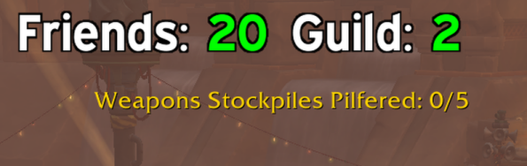
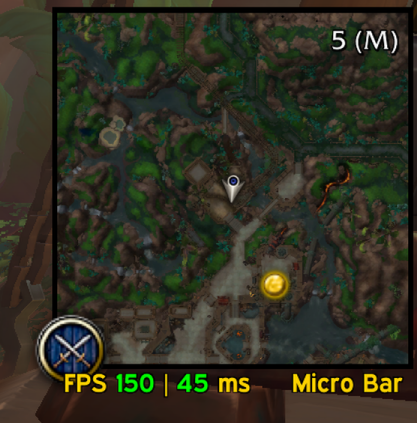

# Chan UI
My addon to fix what I want

## Friendlist & Guildlist
A highly customizable friendlist and guildlist where you can invite, whisper and set notes with a click of the mouse.\
Uses SharedMedia to find fonts/textures/borders etc.\

## Random tweaks
### Move housing controls
For me the housing controls got in the way for my lists so you can choose its position.\

### Move Top Widget
Same problem as housing controls, the Blizzard Top Widget was behind my lists in instances so I could not see some objectives. For example the number of bombs exploded in Floodgate.\

### Hide Expansion summary minimap button
I like a clean minimap and this was ruining it, so I made a toggle.\
